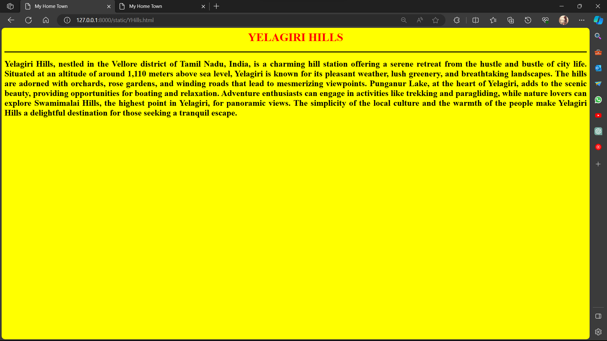

# Ex04 Places Around Me
## Date:22.11.2023 

## AIM
To develop a website to display details about the places around my house.

## DESIGN STEPS

### STEP 1
Create a Django admin interface.

### STEP 2
Download your city map from Google.

### STEP 3
Using ```<map>``` tag name the map.

### STEP 4
Create clickable regions in the image using ```<area>``` tag.

### STEP 5
Write HTML programs for all the regions identified.

### STEP 6
Execute the programs and publish them.

## CODE
```html

map.html

<html>
<head>
<title>My City</title>
</head>
<body>
<h1 align="center">
<font color="black"><b> Tirupattur</b></font>
</h1>
<h3 align="center">
<font color="black"><b>Ezhil sree J (23012968)</b></font>
</h3>
<center>

<map name="MyCity">
<area shape="rect" coords="889,118,820,289" href="YHills.html" title="Yelagiri Hills">
<area shape="circle" coords="850,700,184" href="EFalls.html" title="Ezharuvi Falls">
<area shape="circle" coords="900,440,107" href="JHills.html" title="Javathu Hills">
<area shape="rect" coords="720,400,789,107" href="JFalls.html" title="Jelagamparai Falls">
<area shape="rect" coords="528,400,699,107" href="TPT.html" title="Tirupattur">
</map>
</center>
</body>
</html>

TPT.html

<html>
<head>
<title>My Home Town</title>
</head>
<body bgcolor="pink">
<h1 align="center">   
<font color="red"><b>TIRUPATTUR</b></font>
</h1>
<h2 align="center">
<font color="red"><b>MY HOME TOWN</b></font>
<h3>
<hr size="3" color="black">
<p align="justify">
<font face="tirupattur" size="5">
     Tirupattur, a town in the Vellore district of Tamil Nadu, India, boasts a rich historical and cultural heritage. Situated amidst scenic landscapes, Tirupattur is known for its temples, reflecting
     the region's religious significance. One notable temple is the Sri Subrahmanya Swamy Temple, dedicated to Lord Murugan, which attracts pilgrims and tourists alike with its architectural splendor
     and spiritual ambiance. The town also holds historical relevance, with remnants of ancient structures contributing to its cultural tapestry. Tirupattur serves as a gateway to the Yelagiri hills,          providing access to natural attractions such as Jelagamparai Falls and offering trekking opportunities for adventure enthusiasts. The town's vibrant markets, local cuisine, and hospitable community       add to its charm, making Tirupattur a multifaceted destination for those seeking a blend of history, spirituality, and natural beauty. While these aspects were true as of my last knowledge update in      January 2022, it's advisable to check for any changes or developments in the town since then.
</font>
</p>
</h3>
</body>
</html>

JFalls.html

<html>
<head>
<title>My Home Town</title>
</head>
<body bgcolor="pale blue">
<h1 align="center">   
<font color="red"><b>JELAGAMPARAI FALLS</b></font>
</h1>
 <h3>
<hr size="3" color="black">
<p align="justify">
<font face="Jelagamparai Falls" size="5">
    Jelagamparai Falls, nestled in the scenic Yelagiri hills of the Eastern Ghats near  Tirupattur in Tamil Nadu, India, offers a picturesque retreat for nature enthusiasts  and adventure seekers.            Accessible through a trekking trail that winds through the Yelagiri forests, the falls are renowned for their moderate height and multiple tiers,creating a captivating cascade. The best time              to visit is during the post-monsoon  season from October to February when the water flow is at its peak, and the lush greenery enhances the beauty of the surroundings. The trek to the falls               provides not only a thrilling adventure but also a chance to immerse oneself in the serene ambiance of the Eastern Ghats. Yelagiri, with its pleasant climate, is home to other attractions like            Punganoor Lake and Nature Park and Swamimalai Hills, making a visit to Jelagamparai Falls a part of a broader exploration of the region's natural wonders. While these details   were accurate as          of my last knowledge update in January 2022, it is advisable to verify current conditions and facilities before planning a visit.  
</font>
</p>
</h3>
</body>
</html>

JHills.html

<html>
<head>
<title>My Home Town</title>
</head>
<body bgcolor="cyan">
<h1 align="center">
<font color="red"><b>JAVATHU HILLS</b></font>
</h1>
<h3>
<hr size="3" color="black">
<p align="justify">
<font face="Javathu Hills" size="5">
    Javathu Hills, located in the northern part of Tamilnadu.They are the extension  of the Eastern Ghats and are spread across parts of the Vellore,Tiruvannamalai,and Tirupattr districts.  is a              captivating natural wonder that boasts breathtaking landscapes and serene surroundings. The hills are adorned with lush greenery, making it an ideal destination for nature enthusiasts and hikers          alike. The undulating terrain offers panoramic views of the surrounding valleys and, on clear days, distant mountain ranges. Javathu Hills also holds cultural significance, with indigenous flora          and fauna adding to the region's ecological diversity. Whether you seek adventure through trekking or simply wish to immerse yourself in the tranquility of nature, Javathu Hills provides a                rejuvenating escape from the hustle and bustle of urban life. 
</font>
</p>
</h3>
</body>
</html>

EFalls.html

<html>
<head>
<title>My Home Town</title>
</head>
<body bgcolor="orange">
<h1 align="center">   
<font color="red"><b>EZHARUVI FALLS</b></font>
</h1>
<h3>
<hr size="3" color="black">
<p align="justify">
<font face="Ezharuvi Falls" size="5">
    Ezharuvi Falls, located in the picturesque Western Ghats of India, is a captivating  natural wonder that enchants visitors with its breathtaking beauty. Nestled amidst lush greenery, the falls            cascade gracefully, creating a mesmerizing spectacle as the water tumbles down the rocky terrain. The name "Ezharuvi" translates to "seven streams," signifying the seven distinct channels through         which the water flows, adding to the falls' unique charm. The surrounding landscape is a haven for nature enthusiasts, offering opportunities for trekking and exploration. Visitors can revel in the       soothing sounds of nature and immerse themselves in the serene ambiance that Ezharuvi Falls provides, making it a must-visit destination for those seeking tranquility and natural splendor.
</font>
</p>
</h3>
</body>
</html>

YHills.html

<html>
<head>
<title>My Home Town</title>
</head>
<body bgcolor="yellow">
<h1 align="center">   
<font color="red"><b>YELAGIRI HILLS</b></font>
</h1>
<h3>
<hr size="3" color="black">
<p align="justify">
<font face="Yelagiri Hills" size="5">
    Yelagiri Hills, nestled in the Vellore district of Tamil Nadu, India, is a charming hill station offering a serene retreat from the hustle and bustle of city life.                 Situated at an altitude of around 1,110 meters above sea level, Yelagiri is known 
                for its pleasant weather, lush greenery, and breathtaking landscapes. The hills are 
                adorned with orchards, rose gardens, and winding roads that lead to mesmerizing 
                viewpoints. Punganur Lake, at the heart of Yelagiri, adds to the scenic beauty,
                providing opportunities for boating and relaxation. Adventure enthusiasts can 
                engage in activities like trekking and paragliding, while nature lovers can explore 
                Swamimalai Hills, the highest point in Yelagiri, for panoramic views. The simplicity 
                of the local culture and the warmth of the people make Yelagiri Hills a delightful 
                destination for those seeking a tranquil escape.
            </font>
        </p>
     </h3>
    </body>
</html>
```

## OUTPUT




## RESULT
The program for implementing image maps using HTML is executed successfully.
